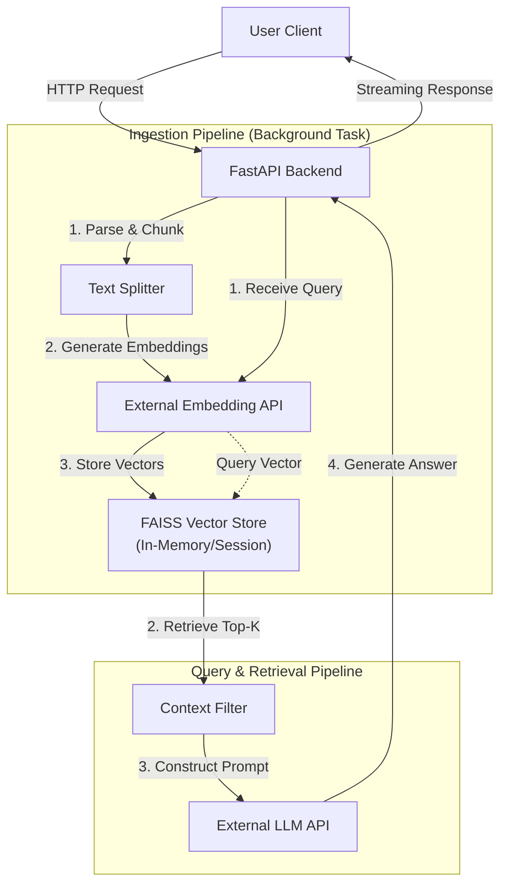

# RAG-Based Question Answering System

## 1. Project Overview

This project implements a Retrieval-Augmented Generation (RAG) system designed to answer questions grounded strictly in user-uploaded documents (PDF or TXT). The system emphasizes reliability, architectural clarity, and adherence to strict engineering constraints. It features a FastAPI backend, a custom embedding integration, FAISS vector storage, and background processing for document ingestion. The application leverages an in-memory session model to ensure data isolation and transient state management.

**Live Demo:** [https://hiring-assigment.vercel.app/](https://hiring-assigment.vercel.app/)

## 2. System Architecture

The system is built as a modular application with the following core components:

*   **API Layer:** FastAPI handles HTTP requests, input validation, and streaming responses.
*   **Ingestion Engine:** A background processing pipeline that parses documents, chunks text, generates embeddings, and updates the vector index.
*   **Vector Store:** FAISS (Facebook AI Similarity Search) using `IndexFlatIP` for efficient inner-product search.
*   **Embedding Service:** Connects to an external BGE-based embedding API to convert text chunks into dense vector representations.
*   **LLM Interface:** Integration with an external Large Language Model API for answer generation.
*   **Session Management:** In-memory, session-scoped storage ensures that uploaded documents and vector indices are isolated per user session.

### Architecture Diagram



## 3. RAG Pipeline Flow

The RAG pipeline operates in two distinct phases: Ingestion and Querying.

**Phase 1: Ingestion**
1.  **Upload:** User uploads a PDF or TXT file.
2.  **Extraction:** Text is extracted from the file.
3.  **Chunking:** The text is split into manageable segments using `RecursiveCharacterTextSplitter`.
4.  **Embedding:** Each chunk is sent to the external embedding API to generate a vector.
5.  **Indexing:** Vectors are added to the session-specific FAISS index.

**Phase 2: Retrieval & Generation**
1.  **Query Analysis:** The user's question is received and embedded using the same embedding API.
2.  **Vector Search:** The query vector is compared against the FAISS index to find the top-k most similar chunks.
3.  **Filtering:** Results are filtered based on a similarity threshold (score < 0.4 discarded) to remove irrelevant context.
4.  **Prompt Construction:** A strictly grounded prompt is constructed containing the retrieved context and the user's query.
5.  **Generation:** The prompt is sent to the LLM, which generates the answer.

## 4. Chunking Strategy

*   **Method:** `RecursiveCharacterTextSplitter`
*   **Chunk Size:** 500 tokens
*   **Chunk Overlap:** 100 tokens

**Justification:**
A chunk size of 500 tokens was selected to balance context preservation with retrieval precision. 500 tokens typically encompass a complete paragraph or a logical thought unit, allowing the embedding model to capture the semantic meaning effectively without introducing excessive noise from unrelated topics. The 100-token overlap ensures that critical information at the boundaries of chunks (such as sentence continuations or immediate context) is not lost, maintaining semantic continuity across segments.

## 5. Retrieval Strategy

The system utilizes **FAISS** with `IndexFlatIP` (Inner Product) to perform efficient similarity searches.

*   **Metric:** Cosine Similarity (via normalized vectors and Inner Product).
*   **Top-K:** The top 4 most relevant chunks are retrieved to fit within the LLM's context window while providing diverse perspectives.
*   **Thresholding:** A strict similarity threshold is applied. Chunks with a similarity score below 0.4 are discarded to prevent the LLM from hallucinating based on irrelevant information.

## 6. Background Ingestion Design

To ensure a responsive user interface, document ingestion is handled asynchronously using FastAPI's `BackgroundTasks`. When a file is uploaded:
1.  The API immediately returns a "processing started" response.
2.  The ingestion pipeline (parsing, chunking, embedding, indexing) runs in the background.
3.  The client polls or waits for the session state to reflect the ready status.

This prevents HTTP timeouts during the processing of large documents and allows for better resource management.

## 7. Rate Limiting

Rate limiting is implemented to prevent abuse and manage load on external APIs.
*   **Mechanism:** In-memory counter tracked per client IP address.
*   **Policy:** Limits the number of requests allowed within a specific time window.
*   **Storage:** Volatile in-memory storage (reset on application restart).

## 8. Grounding & Hallucination Control

To minimize hallucinations and ensure answers are derived solely from the provided documents:
*   **System Prompt:** The LLM is instructed via a rigorous system prompt to answer *only* using the provided context.
*   **Negative Constraint:** The model is explicitly directed to state "I don't know" or "The document does not contain this information" if the retrieved context is insufficient.
*   **Relevance Filtering:** The retrieval threshold (< 0.4) acts as a first line of defense, preventing irrelevant chunks from reaching the generation stage.

## 9. Metrics Tracked

**End-to-End Latency:**
We track the time elapsed from the receipt of the HTTP request to the completion of the response generation. This metric is critical for monitoring the performance impact of external API calls (embeddings and LLM generation) and the FAISS search overhead.

## 10. Observed Retrieval Failure Case

**Failure Case:** Dense Tabular Data
**Observation:** Queries requesting specific data points from large tables within a PDF occasionally failed or returned incorrect rows.
**Analysis:** The `RecursiveCharacterTextSplitter` processes text linearly. When a table spans multiple chunks, or when the header row is separated from the data rows by a chunk boundary, the embedding for the data chunk lacks the semantic context of the column headers. Consequently, the vector search fails to associate the raw numbers with the user's semantic query about specific columns.

## 11. API Endpoints

*   `POST /upload`: Upload a PDF or TXT file for background ingestion.
*   `POST /ask`: Submit a question based on the uploaded document.
*   `GET /health`: Check the system and API status.

## 12. Running the Project Locally

**Prerequisites:**
*   Python 3.9+
*   pip

**Steps:** 

1.  **Clone the repository:**
    ```bash
    git clone <repository_url>
    cd <repository_name>
    ```

2.  **Install dependencies:**
    ```bash
    pip install -r requirements.txt
    ```

3.  **Set Environment Variables:**
    Create a `.env` file or export the following variables:
    *   `LLM_API_KEY`: Key for the LLM service.
    *   `EMBEDDING_API_URL`: Endpoint for the embedding service.

4.  **Run the server:**
    ```bash
    uvicorn app:app --reload
    ```

5.  **Access the UI:**
    Open `http://127.0.0.1:8000` in your browser.

## 13. Limitations & Trade-offs

*   **Streaming & Buffering:** While the application implements `StreamingResponse` for the answer generation, true token-by-token streaming is limited by the hosting environment (Hugging Face Spaces). The environment buffers responses, causing data to arrive in chunks rather than a continuous stream. This is a known infrastructure constraint, and the design optimizes for reliability over real-time fluidity.
*   **In-Memory State:** The vector store and session data are held in memory. Restarting the server results in data loss. This trade-off simplifies deployment and architecture for this assignment but is not suitable for persistent production use cases.
*   **Concurrency:** Heavy reliance on global variables for the in-memory store limits horizontal scaling capabilities without an external database (e.g., Redis/pgvector).

## 14. Conclusion

This project demonstrates a functional, grounded RAG system adhering to strict engineering principles. It balances the complexity of modern NLP pipelines with the constraints of a lightweight, deployment-ready application. The architecture prioritizes correctness and traceability, ensuring that answers are not just generated, but retrieved and synthesized from the user's specific data.